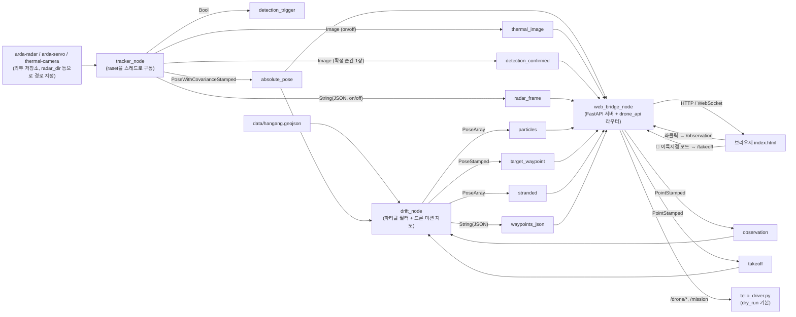

# arda_bringup

ARDA 시스템 ROS2 브링업 패키지 — 레이더·열화상·서보 센서 융합, 파티클
필터 표류 예측, 웹 관제, Tello 드론 자동 수색 비행을 노드 3개로 묶은
단일 런치 패키지.

## 목차

- [🚀 빠른 시작](#-빠른-시작)
- [🛰️ 실 센서(Jetson) 연동 실행](#️-실-센서jetson-연동-실행)
- [📁 파일 구조](#-파일-구조)
- [🔧 뭘 고치려면 어디를 보나](#-뭘-고치려면-어디를-보나)
- [🧩 노드 & 데이터 흐름](#-노드--데이터-흐름)
- [📚 노드 상세 (토픽/파라미터 전체 표)](#-노드-상세-토픽파라미터-전체-표)
- [❓ 왜 이렇게 나눴는가](#-왜-이렇게-나눴는가)
- [⚠️ 드론 안전](#️-드론-안전)
- [알려진 한계](#알려진-한계)

---

## 🚀 빠른 시작

```bash
# 1) 의존성 설치 (최초 1회, 워크스페이스 루트에서)
python3 -m venv --system-site-packages venv
venv/bin/python3 -m pip install fastapi "uvicorn[standard]" pydantic shapely

# 2) 빌드 — 반드시 venv 파이썬으로! (이유는 아래 "빌드가 왜 이렇게 복잡한가" 참고)
venv/bin/python3 $(which colcon) build --packages-select arda_bringup

# 3) 실행
source install/setup.bash
ros2 launch arda_bringup bringup.launch.py
```

브라우저에서 **http://localhost:8000** 접속 → 표류 예측 지도 + 드론 제어판.

`tracker_node`(실 센서)가 아직 연결 안 된 상태라면 화면에 아무것도 안
뜹니다 — 아래 명령으로 좌표를 한 번 수동 발행해서 확인하세요:

```bash
ros2 topic pub --once /arda/tracker/absolute_pose geometry_msgs/msg/PoseWithCovarianceStamped \
  "{header: {frame_id: 'map'}, pose: {pose: {position: {x: 126.907, y: 37.540}}}}"
```

실제 드론/센서 연동 없이 웹 화면(파티클, 히트맵, Waypoint, 관측값 클릭)까지만
보고 싶다면 이 정도로 충분합니다. 실기체·실센서 연동은 [🛰️ 실 센서(Jetson)
연동 실행](#️-실-센서jetson-연동-실행)과 [드론 안전](#️-드론-안전)을
참고하세요.

---

## 🛰️ 실 센서(Jetson) 연동 실행

**Jetson Orin Nano(Super)에서 레이더(USB 시리얼)·서보(GPIO)·열화상(I2C
MLX90640) 세 하드웨어 + 드론 dry-run REST 흐름까지 실측 확인됨** (2026-08-11,
낙하 확정→drift_node 전달 타이밍 버그 수정 포함 — 아래 "⚠️ 실측으로 찾은
버그" 및 [node 상세](#-노드-상세-토픽파라미터-전체-표) 참고).
`launch/bringup.launch.py`의 `radar_dir`/`servo_dir`/`thermal_dir`는 이
보드 기준 형제 디렉터리(`/home/orin/ARDA-2026/{arda-radar,arda-servo,
thermal-camera}`)로 이미 채워져 있습니다. 다른 Jetson 보드에 배포할 때는
세 저장소를 clone한 뒤 이 세 파라미터(또는 `ARDA_RADAR_DIR`/`ARDA_SERVO_DIR`/
`ARDA_THERMAL_DIR` 환경변수)만 그 경로로 바꾸면 됩니다.

### 센서 연동 전용 추가 의존성

`raset`(arda_bringup/raset/)이 import하는 `arda`/`arda_servo`/`thermal_main`
쪽 하드웨어 라이브러리는 `--system-site-packages` venv에 기본으로 없습니다.
["빠른 시작" 1번](#-빠른-시작) 다음에 한 번만 추가로 설치하세요:

```bash
venv/bin/python3 -m pip install \
  pyserial "scikit-learn>=1.4" \
  "Jetson.GPIO==2.1.12" \
  "Adafruit-Blinka==9.1.0" "adafruit-circuitpython-mlx90640==1.3.9" \
  "adafruit-circuitpython-motor==3.4.20" \
  "numpy<2" scipy pandas "opencv-python==4.10.0.84"
```

**`enable_thermal_view`의 YOLO 백엔드(`yolo: True`)를 CUDA로 쓰려면** 추가로:

```bash
venv/bin/python3 -m pip install \
  --index-url https://pypi.jetson-ai-lab.io/jp6/cu126 \
  torch==2.11.0 torchvision==0.26.0

# jetson-ai-lab torch가 dlopen하는 libcudss.so.0을 자체 포함 안 해서 보완 필요
# (thermal-camera/fix_cuda_cudss.sh와 동일한 처리, venv 경로만 다름)
TORCH_LIB=venv/lib/python3.10/site-packages/torch/lib
tmp=$(mktemp -d)
curl -sL -o "$tmp/cudss.whl" \
  "https://files.pythonhosted.org/packages/py3/n/nvidia-cudss-cu12/nvidia_cudss_cu12-0.8.0.10-py3-none-manylinux_2_17_aarch64.whl"
unzip -q "$tmp/cudss.whl" -d "$tmp/extracted"
cp -f "$tmp"/extracted/nvidia/cu12/lib/libcudss*.so.0 "$TORCH_LIB/"
rm -rf "$tmp"
```

`device: 'cuda'`로 둬도 `torch.cuda.is_available()`가 False면 자동으로
CPU로 조용히 대체되므로(에러 없음, `thermal_main_yolo.load_yolo_model()`)
안 켜져 있어도 눈치채기 어렵다 — `venv/bin/python3 -c "import torch;
print(torch.cuda.is_available())"`로 먼저 확인해볼 것.

<details>
<summary>왜 이렇게 많은 패키지가 필요한가 (Jetson Orin Nano Super 기준 실측)</summary>

- `pyserial`/`scikit-learn` — 레이더 시리얼 통신과 DBSCAN 클러스터링
  (`arda.processing.clustering`)에 필요한데 venv엔 없었음.
- `Adafruit-Blinka` + `adafruit-circuitpython-mlx90640` — 열화상 I2C
  (`board.SCL`/`board.SDA`, `adafruit_mlx90640.MLX90640`)에 필요.
- `Jetson.GPIO==2.1.12` — 시스템에 apt로 깔린 2.1.7은 이 보드
  (`p3767-0005-super` compatible 문자열, "Orin Nano Super")를 인식 못 해
  `Exception: Could not determine Jetson model`로 즉시 죽는다. venv 안에
  2.1.12를 설치하면 venv의 site-packages가 시스템보다 우선이라(venv는
  `--system-site-packages`라도 자기 site-packages를 먼저 본다) 이 버전으로
  덮어써진다.
- `numpy<2` / `scipy` / `pandas` — `~/.local`에 사용자 단위로 깔린 numpy
  2.2.6이 `--system-site-packages` venv로 새어 들어와, apt로 numpy 1.x
  기준으로 빌드된 `scipy`/`cv_bridge`(ROS)가 `numpy.dtype size changed`,
  `_ARRAY_API not found` 같은 ABI 오류로 깨진다. venv 안에 이 세 패키지를
  직접 설치해 격리하면 해결된다(`scikit-learn`이 내부적으로 `scipy`/
  `pandas`를 끌어옴).
- `opencv-python==4.10.0.84` — 시스템(`~/.local`)엔 5.0.0.93이 깔려있는데
  `cv2.CV_8UC3` 등 타입 상수값이 구버전과 달라져(4.x: 16, 5.x: 64), 구버전
  OpenCV 기준으로 컴파일된 ROS `cv_bridge`의 타입 테이블과 어긋나
  `cv2_to_imgmsg()`가 `KeyError`로 실패한다(열화상 이미지 토픽 발행 시).
  `thermal_main.py`/`thermal_main_yolo.py`가 실제로 쓰는 cv2 함수
  (`applyColorMap`/`findContours`/`connectedComponentsWithStats`/`resize`
  등)는 전부 4.x/5.x 공통 API라 4.x로 고정해도 동작에 영향 없음.
- `torch==2.11.0`/`torchvision==0.26.0`(jetson-ai-lab `jp6/cu126` 인덱스)
  — `~/.local`에 이미 깔려있던 `torch==2.13.0`은 일반 PyPI aarch64
  wheel(cu130 빌드)이라 이 보드 드라이버(NVIDIA-SMI 540.4.0, CUDA 12.6,
  L4T R36.4.7)로는 `torch.cuda.is_available()`가 항상 False — "driver too
  old" 에러(`torch.cuda.is_available()` 호출 시)로 확인됨. jetson-ai-lab의
  jp6(JetPack 6)/cu126(CUDA 12.6) 인덱스가 이 보드 스펙과 정확히 맞는
  버전이라 CUDA가 정상으로 잡힘(`torch.cuda.get_device_name(0)` → `Orin`
  실측 확인). `libcudss.so.0` 보완 스크립트까지 해야 `import torch`가
  깨지지 않는다.

전부 `arda-bringup/venv`에만 설치한 것이며 `arda-radar`/`arda-servo`/
`thermal-camera`의 자체 `.venv`나 시스템 파이썬은 건드리지 않는다.

</details>

### 빌드 & 실행

["빠른 시작"](#-빠른-시작)의 2)/3)번과 동일하다:

```bash
venv/bin/python3 $(which colcon) build --packages-select arda_bringup
./run.sh          # == source install/setup.bash && ros2 launch arda_bringup bringup.launch.py
```

<details>
<summary>venv를 매번 activate 안 해도 되는 이유</summary>

빌드를 `venv/bin/python3 colcon build`로 하면, 설치되는 각 노드 실행
스크립트(`install/arda_bringup/lib/arda_bringup/tracker_node` 등)의
셔뱅이 `#!/…/venv/bin/python3`로 그대로 박힌다. 그래서 **실행 단계에서는
`source venv/bin/activate`가 필요 없다** — `ros2 launch`가 그 셔뱅을 따라
자동으로 venv 인터프리터로 각 노드 프로세스를 띄운다(`$VIRTUAL_ENV`가 비어
있는 셸에서 실행해도 `cv_bridge`/`sklearn`/`Jetson.GPIO`가 정상 import됨을
실측 확인). `source install/setup.bash`는 venv와 무관하게 ROS2가 패키지
자체를 찾기 위한 오버레이라 항상 필요하다 — 그래서 `run.sh`도 이 한 줄만
source한다.

</details>

### 동작 확인

```bash
# 웹 상태
curl http://localhost:8000/state

# 좌표 수동 주입 — 레이더/열화상 트리거 없이도 파티클 흐름만 바로 확인
ros2 topic pub --once /arda/tracker/absolute_pose geometry_msgs/msg/PoseWithCovarianceStamped \
  "{header: {frame_id: 'map'}, pose: {pose: {position: {x: 126.907, y: 37.540}}}}"

# 드론 미션 좌표 미리보기 (GPS → Tello cm)
curl http://localhost:8000/mission

# 드론 dry-run 흐름 (기본 dry_run=true — 실기체 없이도 REST API 확인 가능)
curl -X POST http://localhost:8000/drone/connect -H "Content-Type: application/json" -d '{"dry_run": true}'
curl -X POST http://localhost:8000/drone/takeoff
curl http://localhost:8000/drone/status
curl -X POST http://localhost:8000/drone/land
```

`tracker_node` 로그에 레이더 `[CFG OK] ... sensorStart`, 열화상
`열화상 센서 안정화 5프레임 대기 중`, 서보 `홈 포지션(90.0°)에서 낙하 트리거
대기 중`이 보이면 세 하드웨어 모두 정상 초기화된 것이다.

레이더가 실제로 뭔가를 감지하면(ROI 안에서 작은 움직임만 있어도 트리거될
수 있다) 로그에 `열화상 판정 요청 전송`이 뜨고, `dwell_seconds`+여유 시간
안에 `낙하 판정 기각`(person=False) 또는 `absolute_pose` 발행(person=True)
으로 이어지는지 확인하면 된다. `열화상 판정 응답 없음(...초 경과)`이 매번
뜬다면 `thermal_pending_timeout`을 더 늘려야 한다(기본 -1=자동이면 이미
`dwell_seconds+30.0`이 적용된 상태 — 그래도 계속 뜨면 열화상 FOV에
지속적으로 흔들리는 열원이 있는지 확인, `/arda/tracker/thermal_status`의
`moving`이 계속 true인지 보면 바로 알 수 있다).

브라우저 패널의 "🌡 열화상 실시간"/"📡 레이더 포인트클라우드" 카드 체크박스를
켜면 각각 `/thermal.jpg` 폴링(0.3초 간격, 관찰 중일 때만 프레임이 옴)과
`radar_frame`의 포인트클라우드/클러스터가 캔버스에 실시간으로 그려진다.

`dwell_seconds`를 튜닝하면서 "사람 확정에 얼마나 가까워졌는지"(누적
매칭 횟수 — 연속일 필요 없음, give-up까지 남은 시간)를 실시간으로 보고
싶으면:

```bash
ros2 topic echo /arda/tracker/thermal_status
```

관찰(dwell) 중에만 프레임마다(2Hz) `matched`/`match_count`/
`required_matches`/`confirmed`/`give_up_remaining_sec`가 찍힌다.
`match_count`가 `required_matches`에 도달하면(`confirmed: true`)
바로 다음에 `/arda/tracker/absolute_pose`가 발행된다.

### 센서 타이밍 분석 (rosbag 녹화)

`dwell_seconds`/`thermal_pending_timeout` 같은 레이더·열화상·서보 타이밍을
튜닝하려면 실기 동작을 rosbag2로 녹화해두고 나중에 시각별로 뜯어보는 게
편하다. `tracker_node`를 이미 띄운 상태(`./run.sh`)에서 **다른 터미널**로:

```bash
./record.sh              # bags/<타임스탬프>/ 에 녹화 (Ctrl+C로 종료)
./record.sh my_test      # bags/my_test/ 로 이름 지정
```

레이더(`detection_trigger`, `radar_frame`), 열화상(`thermal_image`,
`detection_confirmed`), 서보(`servo_status`), 그리고 최종 확정
(`absolute_pose`)까지 관련 토픽을 전부 녹화한다. 분석은:

```bash
ros2 bag info bags/<이름>     # 토픽별 메시지 개수·시작/끝 시각 요약
ros2 bag play bags/<이름>     # 그대로 재생 — 예: 재생하면서 ros2 topic echo로 다시 확인
```

타이밍 튜닝의 핵심은 `detection_trigger`가 찍힌 시각 대비 `absolute_pose`
(또는 `servo_status`의 `dwelling`이 `true`→`false`로 바뀌는 시각)가 얼마나
지나서 찍히는지 비교하는 것이다 — 그 차이가 지금 설정한
`thermal_pending_timeout`보다 크면(즉 `열화상 판정 응답 없음` 로그가
뜨면) 값을 더 늘려야 한다는 뜻이다. `bags/`는 `.gitignore`에 이미 등록돼
있어 실수로 커밋되지 않는다.

---

## 📁 파일 구조

```
src/arda_bringup/
├── arda_bringup/
│   ├── tracker_node.py       ROS 노드 — 센서 융합 (raset을 스레드로 구동)
│   ├── drift_node.py         ROS 노드 — 표류 예측(파티클 필터) + 드론 미션 지도/Waypoint 계산
│   ├── web_bridge_node.py    ROS 노드 — 웹 서버(FastAPI) 호스팅 + 드론 제어 API 마운트
│   │
│   ├── drone_api.py          드론 REST 엔드포인트 (web_bridge_node가 마운트, 별도 노드 아님)
│   ├── tello_driver.py       Tello 실기체 제어 — 배터리 체크·안전 착륙 등 (수정 없이 이식)
│   ├── tello_mission.py      GPS 좌표 → Tello 기체 좌표(cm) 변환 (수정 없이 이식)
│   │
│   └── raset/                레이더+서보+열화상 통합 실행 코드 (수정 없이 이식)
│       ├── bus.py              세 서브시스템 간 이벤트 큐
│       ├── radar_worker.py     레이더 낙하 감지 스레드
│       ├── servo_worker.py     서보 추적 스레드
│       ├── thermal_worker.py   열화상 관찰/판정 스레드
│       └── thermal_backend.py  열화상 판정 백엔드 (threshold/YOLO)
│
├── web/static/
│   ├── index.html            브라우저 UI — 지도, 히트맵, 드론 제어판
│   └── hangang_polygon.png   참고 이미지 (지도 좌표와 정렬 안 됨, 장식용)
│
├── data/
│   └── hangang.geojson       한강 폴리곤(마포대교 구간) — 육지 도달 판정용
│
├── launch/
│   └── bringup.launch.py     전체 노드 실행 + 파라미터 (대부분의 설정 변경은 여기서)
│
├── package.xml / setup.py / setup.cfg   ROS2 패키지 메타/빌드 설정
```

> `tracker_node`가 실제로 동작하려면 `arda-radar`/`arda-servo`/
> `thermal-camera` 세 저장소가 **이 워크스페이스 밖**에 따로 있어야 합니다
> (이 셋은 원본이 여기 존재한 적이 없어서 vendoring 못 함). `raset/`은
> 이미 패키지 안에 들어있습니다. 이 Jetson 보드에는 세 저장소가 이미
> 형제 디렉터리로 clone돼 있고 경로도 연결돼 있습니다 — [🛰️ 실
> 센서(Jetson) 연동 실행](#️-실-센서jetson-연동-실행) 참고.

---

## 🔧 뭘 고치려면 어디를 보나

| 하고 싶은 것 | 파일 | 위치 |
|---|---|---|
| 유속 고정값 바꾸기 | `launch/bringup.launch.py` | `drift_node` 파라미터: `velocity_x`, `velocity_y` |
| 실시간 HRFCO 유속 API 쓰기 | `launch/bringup.launch.py` | `use_hrfco_api: True`, `hrfco_api_key` 입력 |
| 파티클 개수/확산/난류 조정 | `launch/bringup.launch.py` | `num_particles`, `turbulence`, `diffusivity_m` |
| 실물 축소지도 크기·스케일 | `launch/bringup.launch.py` | `map_scale`, `map_print_w_m`, `map_print_h_m`, `map_east_m` |
| 웹 서버 주소/포트 | `launch/bringup.launch.py` | `web_bridge_node` 파라미터: `web_server_host/port` |
| 레이더/서보/열화상 저장소 경로 연결 | `launch/bringup.launch.py` | `tracker_node` 파라미터: `radar_dir`/`servo_dir`/`thermal_dir` |
| 열화상/레이더 웹 시각화 on/off (백엔드) | `launch/bringup.launch.py` | `tracker_node` 파라미터: `enable_thermal_view`, `enable_radar_view` |
| 열화상/레이더 웹 시각화 on/off (화면) | `web/static/index.html` | 패널의 "🌡 열화상 실시간" / "📡 레이더 포인트클라우드" 카드 체크박스 (localStorage에 저장) |
| 레이더/열화상 판정 대기 타임아웃 | `launch/bringup.launch.py` | `tracker_node` 파라미터: `thermal_pending_timeout` (기본 -1=자동, [버그 수정 내역](#-노드-상세-토픽파라미터-전체-표) 참고) |
| 배속·재생 주기 조정 | `launch/bringup.launch.py` | `playback_speed`, `step_period_sec` |
| **드론 안전 기준**(배터리 %, 이동거리 제한 등) | `arda_bringup/tello_driver.py` | 파일 상단 상수: `MIN_BATTERY`, `GO_MIN_CM`, `GO_MAX_CM` 등 |
| 드론 좌표 변환(GPS→Tello cm) 로직 | `arda_bringup/tello_mission.py` | `build_mission()` 함수 |
| 드론 REST API 엔드포인트 추가/수정 | `arda_bringup/drone_api.py` | `router = APIRouter()` 아래 |
| 표류 예측 알고리즘(파티클 이동/히트맵) | `arda_bringup/drift_node.py` | `_on_playback_step()`, `_update_heatmap_and_publish()` |
| 웹 브리지 상태(JSON 스키마) 수정 | `arda_bringup/web_bridge_node.py` | `_on_*` 콜백들, `self._state` |
| 웹 화면(UI/지도/드론 패널) 수정 | `web/static/index.html` | 해당 부분 직접 수정 |
| 한강 폴리곤(육지 판정 범위) 갱신 | `data/hangang.geojson` | 파일 통째로 교체 |
| 센서 융합 로직 자체(레이더 클러스터링, 서보 각도 계산, 열화상 판정) | `arda_bringup/raset/*.py`가 import하는 **원본 저장소**(arda-radar/arda-servo/thermal-camera) | raset은 그 저장소들을 그대로 부르기만 함 — 로직은 원본 저장소에서 고쳐야 함 |
| 새 ROS 노드 추가 | 새 `.py` 파일 + `setup.py`의 `entry_points` + `launch/bringup.launch.py` | — |

---

## 🧩 노드 & 데이터 흐름

| 노드 | 역할 |
|---|---|
| **tracker_node** | 레이더+열화상+서보 센서 융합 → 낙하 절대좌표(GPS) 산출 |
| **drift_node** | 파티클 필터 표류 예측 + 육지 도달 감지 + 드론 미션용 지도/Waypoint 계산 |
| **web_bridge_node** | 웹 서버(FastAPI) 호스팅 + 드론 제어 API 마운트 |



전체 토픽은 `/arda/tracker/*`, `/arda/drift/*` prefix가 붙습니다(위
다이어그램은 간략화를 위해 생략).

---

## 📚 노드 상세 (토픽/파라미터 전체 표)

<details>
<summary><strong>1️⃣ tracker_node — 센서 감지 & 융합</strong></summary>

레이더/서보/열화상을 한 프로세스에서 통합 구동하던 **raset** 코드를
`arda_bringup/raset/`에 그대로 옮겨와(수정 없음) ROS2 노드로 감쌌습니다.

> ✅ **Jetson Orin Nano(Super)에서 실측 확인됨** (2026-08-11): 레이더
> USB 시리얼 CFG 시퀀스·`sensorStart`, 열화상 MLX90640 I2C 초기화, 서보
> GPIO 홈 포지션 이동까지 세 하드웨어 모두 정상 기동. 필요한 추가 의존성과
> 겪은 이슈는 [🛰️ 실 센서(Jetson) 연동 실행](#️-실-센서jetson-연동-실행)
> 참고. 세 경로 파라미터를 비워두면(또는 해당 디렉터리가 없으면) 센서 없이
> 대기 상태로만 남고 나머지 노드는 정상 동작합니다.

**발행 토픽**

| 토픽 | 타입 | 설명 |
|---|---|---|
| `/arda/tracker/detection_trigger` | `Bool` | 레이더가 낙하 후보 발견 → 열화상에 확인 요청 (아직 미확정) |
| `/arda/tracker/absolute_pose` | `PoseWithCovarianceStamped` | 열화상이 "사람 맞음"으로 확정한 GPS 좌표 (x=경도, y=위도) |
| `/arda/tracker/thermal_image` | `Image` | 관찰(dwell) 중 열화상 프레임 연속 스트림 (검출 오버레이 포함). `enable_thermal_view=false`면 발행 안 함 |
| `/arda/tracker/detection_confirmed` | `Image` | 사람이 확정된 **그 순간**의 열화상 프레임 1장 (확정 이벤트마다만 발행) — 웹 패널 맨 위 "🎯 사람 확인됨" 카드에 시각과 함께 표시됨. `enable_thermal_view`와 무관하게 항상 발행 |
| `/arda/tracker/radar_frame` | `String`(JSON) | 레이더 포인트클라우드/클러스터 스냅샷(시각화 전용, 5Hz) — `points`, `n_clusters`, `cluster_centroids`. `enable_radar_view=false`면 발행 안 함 |
| `/arda/tracker/servo_status` | `String`(JSON) | 서보 각도/dwell 상태 스냅샷(5Hz, 항상 발행) — `angle`, `dwelling`, `dwell_remaining_sec`, `thermal_engaged`. rosbag 타이밍 분석용 |
| `/arda/tracker/thermal_status` | `String`(JSON) | 열화상 판정 진행 상태(관찰 중에만, 프레임마다) — `matched`, `match_count`/`required_matches`(누적 매칭 횟수 — 연속일 필요 없음), `moving`, `confirmed`, `give_up_remaining_sec`, `detail`(원형도/종횡비/채움비율 등 실제 판정 수치 + 임계값, threshold 백엔드 기준. `--yolo`면 `confidence`만). **"사람인지 잡는 그 포인트"(matched가 왜 true/false인지) 확인은 이 토픽의 `detail`을 보면 된다** |

**주요 파라미터**

| 파라미터 | 기본값 | 설명 |
|---|---|---|
| `radar_dir` / `servo_dir` / `thermal_dir` | `''` (필수) | 각 저장소 경로. 비우면 `ARDA_RADAR_DIR` 등 환경변수 |
| `simulate_servo` / `simulate_thermal` / `no_radar` | false / false / false | 센서 없이 시뮬레이션/생략 |
| `yolo` / `model_path` / `confidence_threshold` / `device` | false / `''` / 0.4 / `'cuda'` | 열화상 YOLO 판정 (기본은 threshold) |
| `dwell_seconds` / `required_matches` / `settle_offset` | 10.0 / 3 / 0.15 | 열화상 관찰 파라미터. `required_matches`는 누적 매칭 횟수(연속일 필요 없음) |
| `dwell_margin_seconds` | 30.0 | `thermal_pending_timeout`/`servo_dwell_seconds` 자동 계산이 공유하는 안전 마진 (sensor.md §1 참고) |
| `thermal_pending_timeout` | **-1**(자동 = `dwell_seconds+dwell_margin_seconds`) | 레이더가 열화상 판정을 기다리는 최대 시간 — 아래 "⚠️ 실측으로 찾은 버그" 참고 |
| `servo_dwell_seconds` | **-1**(자동 = `max(yaml 값, dwell_seconds+dwell_margin_seconds)`) | 서보가 마지막 조준 각도에서 버티는 시간 (sensor.md §2 참고) |
| `radar_cli_port` / `radar_data_port` | `/dev/ttyUSB0` / `/dev/ttyUSB1` | 레이더 시리얼 포트 |
| `enable_thermal_view` / `enable_radar_view` | true / true | 웹 화면 시각화용 토픽 발행 on/off (끄면 대역폭 절약, 브라우저 체크박스로도 별도 제어) |
| `show_thermal` | false | raset의 `--show-thermal`과 동일 — 관찰 중 열화상 컬러맵을 이 보드에 붙은 모니터(X11, `DISPLAY` 필요)에 로컬 창으로도 띄움. `enable_thermal_view`(ROS/웹 발행)와 독립적, `DISPLAY` 없으면 자동 무시 |

⚠️ **실측으로 찾은 버그(수정됨) — 낙하 확정이 drift_node로 전달 안 되던 원인**:
raset 원본(`main.py`)의 `--thermal-pending-timeout` 기본값이 `--dwell-seconds`와
똑같이 10.0이었습니다. 그런데 열화상의 실제 관찰 소요시간은 `dwell_seconds`
그 자체가 아니라 **항상 그보다 더** 걸립니다 — 트리거 전파 지연, 프레임 주기
(0.5s) 지연에 더해, 관찰 중 열원이 `settle_offset` 밖에서 계속 움직이면
give-up 카운트다운 자체가 계속 리셋되기 때문입니다(`thermal_worker.py`의
`if moving: give_up_deadline = None`). 그 결과 **레이더 쪽이 먼저 timeout
처리를 해버려 대기 상태(`bus.pending_location`)를 지우고, 뒤늦게 도착한
열화상 판정(person 확정이든 기각이든)은 조용히 버려져** `absolute_pose`가
전혀 발행되지 않았습니다 — 토픽명·타입·QoS는 전부 정상이었기 때문에
겉으로는 "wiring은 맞는데 아무것도 안 옴"으로 보였던 것입니다. Jetson
실기(라이브 레이더+열화상)로 재현한 결과, give-up 경로(관찰 중 아무것도
안 잡히는 경우)에서는 초과분이 트리거마다 5~9.5초 정도였는데, 열원이
화면 가장자리에서 계속 "움직이는" 상태로 오래 머무는 경로(=give-up
카운트다운 자체가 계속 리셋되는 경우)에서는 confirmed=true까지 40초
넘게 걸리는 것도 실측됐습니다(`/arda/tracker/thermal_status`로 프레임별
`match_count`를 직접 보고 확인 — 15초 마진으로는 이 케이스에서 재발
했음). 그래서 `thermal_pending_timeout`을 명시하지 않으면
`dwell_seconds+dwell_margin_seconds`(기본 30.0)를 자동으로 쓰도록
고쳤습니다(`tracker_node.py`의 `_start_raset()` 계산부 주석 참고).
`raset/` 코드 자체는 건드리지 않았습니다 — 이 값은 raset이 그대로 받는
파라미터라 상위(`arda_bringup`)
레이어에서 안전한 기본값을 계산해 넘기는 것만으로 충분합니다. 다만
열원이 병적으로 계속 흔들리며 `settle_offset` 안으로 절대 안 들어오면
이 마진도 여전히 부족할 수 있습니다(raset 자체의 give-up 로직이
unbounded라 완전한 보장은 raset을 고쳐야만 가능 — 실기 테스트 중이면
카메라 중앙에 빠르게 정지 상태로 들어오는 게 이 경로를 피하는 가장
확실한 방법).

</details>

<details>
<summary><strong>2️⃣ drift_node — 표류 예측 & 드론 미션 지도</strong></summary>

`/arda/tracker/absolute_pose`로 처음 받은 좌표를 **입수 지점**으로 삼아
파티클을 초기화하고, 그 좌표 기준 드론 미션용 고정 격자를 만듭니다. 이후
재감지/관측값이 오면 파티클을 재수렴시킵니다. 강 가운데 섬에 부딪히면
반사시켜 비켜 흐르게 하고, 강기슭을 벗어나면 "육지 도달"로 기록합니다.

**구독 토픽**

| 토픽 | 타입 | 설명 |
|---|---|---|
| `/arda/tracker/absolute_pose` | `PoseWithCovarianceStamped` | 최초 1회=입수 지점, 이후=재감지 |
| `/arda/drift/observation` | `PointStamped` | 왼쪽 클릭 관측값 — 재수렴 |
| `/arda/drift/takeoff` | `PointStamped` | 드론 이륙 지점 (재)설정 — 파티클 필터는 안 건드림 |
| `/arda/drift/takeoff_reset` | `Empty` | 이륙 지점을 기본값으로 복귀 |
| `/arda/drift/map_config` | `String`(JSON) | 실물 축소 지도 설정 변경 — 격자·히트맵 리셋 |

**발행 토픽**

| 토픽 | 타입 | 설명 |
|---|---|---|
| `/arda/drift/particles` | `PoseArray` | 강 안 표류 파티클 군집 |
| `/arda/drift/target_waypoint` | `PoseStamped` | 최우선 수색 목표 좌표 |
| `/arda/drift/stranded` | `PoseArray` | 육지 도달 파티클 누적 좌표 (최근 800개) |
| `/arda/drift/waypoints_json` | `String`(JSON) | NMS Waypoint 목록 + 히트맵 + 지도/이륙 지점 설정 |

**주요 파라미터**

| 파라미터 | 기본값 | 설명 |
|---|---|---|
| `num_particles` / `turbulence` / `diffusivity_m` | 200 / 0.3 / 2.0 | 파티클 수 / 난류 강도 / 확산 계수 |
| `playback_speed` | **1** | 배속(드론 연동 기본값 — 크게 하면 드론 이륙 전에 파티클이 지도 벗어남) |
| `map_scale` / `map_print_w_m` / `map_print_h_m` / `map_east_m` | 150 / 3.0 / 2.0 / 50.0 | 실물 축소 지도(1:150, 3m×2m, 동쪽 여유 50m) |
| `hist_half_life_sec` / `nms_max_count` | 20.0 / 10 | 히트맵 감쇠 반감기 / 최대 Waypoint 수 |
| `takeoff_margin_map_m` | 0.30 | 이륙 지점 기본 위치(지도 밖 여유, 실물 m) |
| `velocity_x` / `velocity_y` | -1.5 / 0.05 | 고정 유속(m/s) |
| `use_hrfco_api` / `hrfco_api_key` | false / `''` | HRFCO 실시간 유속 API 전환 |
| `enable_land_detection` / `river_geojson_path` | true / `''`(내장 파일) | 육지 도달 감지 켜기/끄기, 폴리곤 경로 |

<details><summary>전체 파라미터 표 펼치기</summary>

| 파라미터 | 기본값 | 설명 |
|---|---|---|
| `dt` | 0.1 | 시뮬레이션 타임스텝(초) |
| `step_period_sec` | 0.1 | 재생 타이머 주기(초) |
| `initial_spread_m` / `reacquire_spread_m` | 10.0 / 5.0 | 최초 시딩 / 재수렴 반경 |
| `grid_cell_m` | 15.0 | 히트맵 격자 한 칸 실제 거리 |
| `hrfco_obs_code` | `'1018683'` | HRFCO 관측소 코드 |
| `river_width_m` / `river_depth_m` | 900.0 / 6.0 | 유량→유속 역산용 단면 폭/수심 |
| `velocity_refresh_period_sec` | 600.0 | HRFCO API 재호출 주기(초) |
| `river_simplify_deg` | 0.00003 | 폴리곤 단순화 허용 오차 (충돌 판정 성능용) |
| `log_interval_sec` / `verbose` | 180.0 / true | 콘솔 로그 주기 / 켜기끄기 |

</details>
</details>

<details>
<summary><strong>3️⃣ web_bridge_node — 웹 관제 브리지 + 드론 제어</strong></summary>

FastAPI 웹 서버를 노드 내부 스레드에서 직접 호스팅하고, 드론 제어
라우터(`drone_api.py`)도 여기 마운트됩니다(별도 드론 노드 없음 — 이유는
[아래 FAQ](#-왜-이렇게-나눴는가) 참고). 히트맵/Waypoint/지도 설정은
drift_node가 계산해 보낸 값을 그대로 씁니다(재계산 안 함).

**구독 토픽**: `absolute_pose`, `thermal_image`, `detection_confirmed`,
`radar_frame`, `particles`, `target_waypoint`, `stranded`, `waypoints_json`
(전부 위 표 참고)

**발행 토픽**

| 토픽 | 타입 | 설명 |
|---|---|---|
| `/arda/drift/observation` | `PointStamped` | 왼쪽 클릭 → `POST /observation` |
| `/arda/drift/takeoff` | `PointStamped` | "🚁 이륙 지점" 모드 클릭 → `POST /takeoff` |
| `/arda/drift/takeoff_reset` | `Empty` | `POST /takeoff/reset` |
| `/arda/drift/map_config` | `String`(JSON) | `POST /map`, `/map/reset` |

**웹 엔드포인트** (기본 `http://0.0.0.0:8000`)

| 메서드 | 경로 | 설명 |
|---|---|---|
| `GET` | `/` | 시각화 + 드론 제어판 페이지 |
| `GET` | `/state` | 현재 상태 JSON |
| `GET` | `/river-geojson` | 한강 폴리곤 |
| `GET` | `/thermal.jpg` | 최신 열화상 프레임 (웹 패널 "🌡 열화상 실시간" 카드가 체크박스 켜지면 0.3초 간격으로 폴링) |
| `POST` | `/observation` | 관측값 재수렴 |
| `POST` | `/takeoff`, `/takeoff/reset` | 드론 이륙 지점 설정/복귀 (비행 중 409 거부) |
| `POST` | `/map`, `/map/reset` | 지도 설정 변경 (비행 중 409 거부) |
| `GET` | `/mission` | 현재 Waypoint → Tello 좌표(cm) 미리보기 |
| `POST` | `/drone/connect` | 드론 연결 (`dry_run` 기본 true) |
| `POST` | `/drone/start` | 자동 미션 비행 시작 |
| `POST` | `/drone/takeoff`, `/drone/goto`, `/drone/home` | 수동 이륙 / 이동 / 복귀 |
| `POST` | `/drone/land` | 즉시 착륙 (비상 정지) |
| `GET` | `/drone/status` | 드론 상태 |
| `WS` | `/ws` | 100ms 주기 상태 스트림 |

**주요 파라미터**: `web_server_host`/`web_server_port` (기본
`0.0.0.0`/`8000`)

</details>

---

## ❓ 왜 이렇게 나눴는가

<details>
<summary><strong>Q. 드론 제어가 왜 별도 drone_node가 아니라 web_bridge_node 안에 있나?</strong></summary>

원본(`drone_api.py`)이 이미 "상태 조회 함수를 주입받아 FastAPI 라우터로
동작"하도록 설계돼 있었습니다. FastAPI 앱은 web_bridge_node가 갖고
있으니 그 라우터를 그대로 마운트하는 게 가장 자연스럽습니다. 별도
`drone_node`로 분리하려면 커스텀 `.srv`/`.action` 인터페이스 패키지를
새로 만들어야 해서(아래 항목 참고), 원본 구조를 최대한 보존하는 쪽을
택했습니다.

</details>

<details>
<summary><strong>Q. 입수 지점(entry)과 이륙 지점(takeoff)은 왜 따로 있나?</strong></summary>

- **입수 지점**: 카메라가 감지한 실제 사고 위치. 한 번 정해지면 안 바뀜.
- **이륙 지점**: 드론이 뜨는 자리(Tello 좌표계 원점). 입수 지점과 겹치면
  Waypoint 1번이 이륙 지점과 붙어 Tello 최소 이동거리(20cm) 미만이 돼서
  스킵됩니다. 그래서 지도 동쪽 바깥에 기본 배치하고, "🚁 이륙 지점"
  버튼으로 따로 옮깁니다.

</details>

<details>
<summary><strong>Q. 왜 커스텀 ROS 메시지 대신 JSON 문자열(String)을 쓰나?</strong></summary>

Waypoint(확률 포함)·지도 설정처럼 임의 필드가 필요한 데이터는
`PoseArray` 같은 표준 메시지에 못 담습니다. 정식 커스텀 `.msg`를 만들려면
별도 `ament_cmake` 인터페이스 패키지가 필요해 워크스페이스가 복잡해져서,
`/arda/drift/waypoints_json`에 JSON을 실어 보내는 실용적 선택을 했습니다.

</details>

<details>
<summary><strong>Q. tracker_node는 raset 코드를 어떻게 안 고치고 ROS에 연결했나?</strong></summary>

raset의 이벤트 큐(`bus.py`)는 **단일 소비자** 구조라 직접 읽으면(`.get()`)
원래 소비자가 값을 못 받아 raset이 망가집니다. 그래서 `_TeeQueue`라는
얇은 래퍼로 `put()`마다 콜백을 먼저 호출한 뒤 원본 큐에 전달하고, `get()`은
원본에 그대로 위임합니다(콜백을 원본 전달보다 먼저 실행하는 이유는 아래
버그 참고). 열화상 프레임은 `cv2.imshow`(raset 전체에서 한 곳에서만 쓰임)를
ROS 발행 함수로 바꿔치기해서 받습니다. 자세한 내용은 `tracker_node.py`
상단 docstring 참고.

이 원칙에서 딱 두 곳(`raset/bus.py`에 큐 필드 하나, `raset/radar_worker.py`에
`.put()` 한 줄)은 예외적으로 손댔습니다 — 레이더 포인트클라우드를 웹에
시각화하려면 그 데이터를 어딘가로 내보내야 하는데, raset 어디에도 노출되는
곳이 없었기 때문입니다(기존 로직 변경 없이 데이터만 한 줄 더 내보냄).

⚠️ **실측으로 찾은 버그**: `_TeeQueue.put()`이 원래 "원본 큐에 먼저 전달 →
콜백 나중 호출" 순서였는데, `verdict_q`처럼 콜백이 `bus.pending_location`
같은 다른 스레드와 공유하는 상태를 읽는 경우 이 순서가 위험합니다 — 원본
전달 직후 다른 스레드(radar_worker)가 바로 그 값을 소비하고 상태를 지워버릴
수 있어서입니다. 지금은 순서를 뒤집어 콜백을 먼저 실행합니다. 다만 이
프로젝트에서 낙하 확정이 실제로 유실됐던 주된 원인은 이 순서 문제가 아니라
`thermal_pending_timeout` 마진 버그였습니다 — 자세한 내용은 [tracker_node
노드 상세](#-노드-상세-토픽파라미터-전체-표)의 "⚠️ 실측으로 찾은 버그" 참고.

</details>

<details>
<summary><strong>Q. 빌드가 왜 이렇게 복잡한가 (venv + colcon)?</strong></summary>

`fastapi`/`uvicorn`/`pydantic`/`shapely`는 rosdep에 없어 pip 설치가
필요한데, 시스템 파이썬을 안 건드리려고 `--system-site-packages` venv를
씁니다. 그런데 `colcon`/`ros2` 실행 파일은 셔뱅이 시스템 파이썬으로
고정돼 있어서 venv를 활성화해도 무시됩니다 — 그래서
`venv/bin/python3 $(which colcon) build ...`처럼 인터프리터를 직접
지정해서 셔뱅을 우회합니다. 이렇게 빌드해야 설치된 실행 스크립트의
셔뱅도 venv를 가리켜서 `ros2 run`/`ros2 launch`가 정상 동작합니다.

`src/arda_bringup/setup.cfg`는 ROS2 `ament_python` 패키지의 필수 파일로,
콘솔 스크립트를 `lib/arda_bringup/`에 설치하도록 지정합니다 — 없으면
`ros2 run`이 실패합니다.

</details>

---

## ⚠️ 드론 안전

실제 Tello 드론을 조종하는 기능이 포함되어 있습니다. `tello_driver.py`
(원본 코드 수정 없이 그대로 이식)의 안전장치:

| 안전장치 | 내용 |
|---|---|
| `dry_run` 기본값 | **true** — 실기체 띄우려면 브라우저에서 명시적으로 전환 + 확인 팝업 + `djitellopy` 설치 필요 |
| 배터리 체크 | 이륙 전 `MIN_BATTERY=30%` 미만이면 거부 |
| 지도 밖 waypoint | 하나라도 있으면 미션 전체 거부 |
| 이동거리 제한 | Tello `go` 명령 20~500cm 범위 밖이면 해당 구간 스킵 |
| 예외 처리 | 어떤 예외든 `finally`에서 반드시 착륙 시도 |
| 비상 정지 | `abort` 플래그로 언제든 중단 (`POST /drone/land`) |
| 유휴 자동 착륙 | 수동 모드 90초 유휴 시 자동 착륙 (배터리 소진 추락 방지) |

**`dry_run` 모드 REST 흐름은 `ros2 launch` 환경에서 end-to-end 검증됨**
(`/drone/connect` → `/drone/takeoff` → `/drone/status` → `/drone/land`,
Jetson Orin Nano Super, 2026-08-11) — `/mission`이 만드는 Tello 좌표
(`tello_x_cm`/`tello_y_cm`)도 실제 GPS 좌표로 계산 확인함. **실제 Tello
기체를 띄우는 것 자체는 아직 검증 안 됨** — `dry_run=false`로 처음 띄우기
전에 반드시 `/mission` 미리보기로 방향/크기가 기대와 맞는지 먼저
확인하세요.

---

## 알려진 한계

- `tracker_node`는 Jetson Orin Nano(Super) + arda-radar/arda-servo/
  thermal-camera 실 하드웨어 환경에서 기동은 물론, 레이더 트리거 →
  열화상 판정 → (person=False 시) 정상 기각 로그까지 실측 확인됐습니다
  (ROI 주변 미세한 움직임이 우연히 레이더를 여러 차례 트리거해 검증
  기회가 됐습니다 — 의도적으로 사람을 낙하시켜 person=True 확정까지
  재현하지는 못했습니다). 이 과정에서 [낙하 확정이 drift_node로 전달
  안 되던 타이밍 버그](#-노드-상세-토픽파라미터-전체-표)를 실측으로
  발견해 고쳤습니다.
- 드론 관련 REST 엔드포인트(`/drone/*`, `/mission`, `/takeoff`, `/map`)는
  `dry_run` 모드로 `ros2 launch` 환경에서 end-to-end 검증됐지만, 실제
  Tello 기체 비행 자체는 검증되지 않았습니다.
- `report_url`이 설정돼 있으면 원본 HTTP 리포팅과 ROS 토픽 발행이 동시에
  일어납니다 — 중복이 싫다면 `report_url`을 비워두세요.
- `stranded_count`는 전체 목록 길이이고, 실제 발행되는
  `/arda/drift/stranded`는 최근 800개로 잘려서 나갑니다.
- `web_bridge_node`의 `velocity_x_display`는 첫 `waypoints_json` 수신
  전까지만 유효한 초기값입니다.
