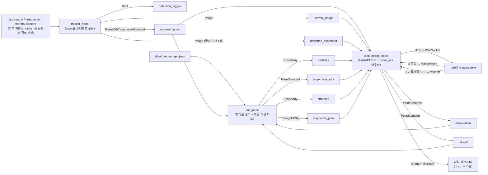

# arda_bringup

ARDA 시스템 ROS2 브링업 패키지 — 레이더·열화상·서보 센서 융합, 파티클
필터 표류 예측, 웹 관제, Tello 드론 자동 수색 비행을 노드 3개로 묶은
단일 런치 패키지.

## 목차

- [🚀 빠른 시작](#-빠른-시작)
- [📁 파일 구조](#-파일-구조)
- [🔧 뭘 고치려면 어디를 보나](#-뭘-고치려면-어디를-보나)
- [🧩 노드 & 데이터 흐름](#-노드--데이터-흐름)
- [📚 노드 상세 (토픽/파라미터 전체 표)](#-노드-상세-토픽파라미터-전체-표)
- [❓ 왜 이렇게 나눴는가](#-왜-이렇게-나눴는가)
- [⚠️ 드론 안전](#️-드론-안전)
- [알려진 한계](#알려진-한계)

---

## 🚀 빠른 시작

```bash
# 1) 의존성 설치 (최초 1회, 워크스페이스 루트에서)
python3 -m venv --system-site-packages venv
venv/bin/python3 -m pip install fastapi "uvicorn[standard]" pydantic shapely

# 2) 빌드 — 반드시 venv 파이썬으로! (이유는 아래 "빌드가 왜 이렇게 복잡한가" 참고)
venv/bin/python3 $(which colcon) build --packages-select arda_bringup

# 3) 실행
source install/setup.bash
ros2 launch arda_bringup bringup.launch.py
```

브라우저에서 **http://localhost:8000** 접속 → 표류 예측 지도 + 드론 제어판.

`tracker_node`(실 센서)가 아직 연결 안 된 상태라면 화면에 아무것도 안
뜹니다 — 아래 명령으로 좌표를 한 번 수동 발행해서 확인하세요:

```bash
ros2 topic pub --once /arda/tracker/absolute_pose geometry_msgs/msg/PoseWithCovarianceStamped \
  "{header: {frame_id: 'map'}, pose: {pose: {position: {x: 126.907, y: 37.540}}}}"
```

실제 드론/센서 연동 없이 웹 화면(파티클, 히트맵, Waypoint, 관측값 클릭)까지만
보고 싶다면 이 정도로 충분합니다. 실기체·실센서 연동은 [뭘 고치려면 어디를
보나](#-뭘-고치려면-어디를-보나)와 [드론 안전](#️-드론-안전)을 참고하세요.

---

## 📁 파일 구조

```
src/arda_bringup/
├── arda_bringup/
│   ├── tracker_node.py       ROS 노드 — 센서 융합 (raset을 스레드로 구동)
│   ├── drift_node.py         ROS 노드 — 표류 예측(파티클 필터) + 드론 미션 지도/Waypoint 계산
│   ├── web_bridge_node.py    ROS 노드 — 웹 서버(FastAPI) 호스팅 + 드론 제어 API 마운트
│   │
│   ├── drone_api.py          드론 REST 엔드포인트 (web_bridge_node가 마운트, 별도 노드 아님)
│   ├── tello_driver.py       Tello 실기체 제어 — 배터리 체크·안전 착륙 등 (수정 없이 이식)
│   ├── tello_mission.py      GPS 좌표 → Tello 기체 좌표(cm) 변환 (수정 없이 이식)
│   │
│   └── raset/                레이더+서보+열화상 통합 실행 코드 (수정 없이 이식)
│       ├── bus.py              세 서브시스템 간 이벤트 큐
│       ├── radar_worker.py     레이더 낙하 감지 스레드
│       ├── servo_worker.py     서보 추적 스레드
│       ├── thermal_worker.py   열화상 관찰/판정 스레드
│       └── thermal_backend.py  열화상 판정 백엔드 (threshold/YOLO)
│
├── web/static/
│   ├── index.html            브라우저 UI — 지도, 히트맵, 드론 제어판
│   └── hangang_polygon.png   참고 이미지 (지도 좌표와 정렬 안 됨, 장식용)
│
├── data/
│   └── hangang.geojson       한강 폴리곤(마포대교 구간) — 육지 도달 판정용
│
├── launch/
│   └── bringup.launch.py     전체 노드 실행 + 파라미터 (대부분의 설정 변경은 여기서)
│
├── package.xml / setup.py / setup.cfg   ROS2 패키지 메타/빌드 설정
```

> `tracker_node`가 실제로 동작하려면 `arda-radar`/`arda-servo`/
> `thermal-camera` 세 저장소가 **이 워크스페이스 밖**에 따로 있어야 합니다
> (이 셋은 원본이 여기 존재한 적이 없어서 vendoring 못 함). `raset/`은
> 이미 패키지 안에 들어있습니다.

---

## 🔧 뭘 고치려면 어디를 보나

| 하고 싶은 것 | 파일 | 위치 |
|---|---|---|
| 유속 고정값 바꾸기 | `launch/bringup.launch.py` | `drift_node` 파라미터: `velocity_x`, `velocity_y` |
| 실시간 HRFCO 유속 API 쓰기 | `launch/bringup.launch.py` | `use_hrfco_api: True`, `hrfco_api_key` 입력 |
| 파티클 개수/확산/난류 조정 | `launch/bringup.launch.py` | `num_particles`, `turbulence`, `diffusivity_m` |
| 실물 축소지도 크기·스케일 | `launch/bringup.launch.py` | `map_scale`, `map_print_w_m`, `map_print_h_m`, `map_east_m` |
| 웹 서버 주소/포트 | `launch/bringup.launch.py` | `web_bridge_node` 파라미터: `web_server_host/port` |
| 레이더/서보/열화상 저장소 경로 연결 | `launch/bringup.launch.py` | `tracker_node` 파라미터: `radar_dir`/`servo_dir`/`thermal_dir` |
| 배속·재생 주기 조정 | `launch/bringup.launch.py` | `playback_speed`, `step_period_sec` |
| **드론 안전 기준**(배터리 %, 이동거리 제한 등) | `arda_bringup/tello_driver.py` | 파일 상단 상수: `MIN_BATTERY`, `GO_MIN_CM`, `GO_MAX_CM` 등 |
| 드론 좌표 변환(GPS→Tello cm) 로직 | `arda_bringup/tello_mission.py` | `build_mission()` 함수 |
| 드론 REST API 엔드포인트 추가/수정 | `arda_bringup/drone_api.py` | `router = APIRouter()` 아래 |
| 표류 예측 알고리즘(파티클 이동/히트맵) | `arda_bringup/drift_node.py` | `_on_playback_step()`, `_update_heatmap_and_publish()` |
| 웹 브리지 상태(JSON 스키마) 수정 | `arda_bringup/web_bridge_node.py` | `_on_*` 콜백들, `self._state` |
| 웹 화면(UI/지도/드론 패널) 수정 | `web/static/index.html` | 해당 부분 직접 수정 |
| 한강 폴리곤(육지 판정 범위) 갱신 | `data/hangang.geojson` | 파일 통째로 교체 |
| 센서 융합 로직 자체(레이더 클러스터링, 서보 각도 계산, 열화상 판정) | `arda_bringup/raset/*.py`가 import하는 **원본 저장소**(arda-radar/arda-servo/thermal-camera) | raset은 그 저장소들을 그대로 부르기만 함 — 로직은 원본 저장소에서 고쳐야 함 |
| 새 ROS 노드 추가 | 새 `.py` 파일 + `setup.py`의 `entry_points` + `launch/bringup.launch.py` | — |

---

## 🧩 노드 & 데이터 흐름

| 노드 | 역할 |
|---|---|
| **tracker_node** | 레이더+열화상+서보 센서 융합 → 낙하 절대좌표(GPS) 산출 |
| **drift_node** | 파티클 필터 표류 예측 + 육지 도달 감지 + 드론 미션용 지도/Waypoint 계산 |
| **web_bridge_node** | 웹 서버(FastAPI) 호스팅 + 드론 제어 API 마운트 |



전체 토픽은 `/arda/tracker/*`, `/arda/drift/*` prefix가 붙습니다(위
다이어그램은 간략화를 위해 생략).

---

## 📚 노드 상세 (토픽/파라미터 전체 표)

<details>
<summary><strong>1️⃣ tracker_node — 센서 감지 & 융합</strong></summary>

레이더/서보/열화상을 한 프로세스에서 통합 구동하던 **raset** 코드를
`arda_bringup/raset/`에 그대로 옮겨와(수정 없음) ROS2 노드로 감쌌습니다.

> ⚠️ **이 환경에서 검증 못 함**: `arda-radar`/`arda-servo`/`thermal-camera`
> 저장소가 이 워크스페이스에 없고, Jetson 전용 하드웨어 의존성이라
> 문법 검사만 했습니다. 세 경로 파라미터를 비워두면 센서 없이 대기
> 상태로만 남고 나머지 노드는 정상 동작합니다.

**발행 토픽**

| 토픽 | 타입 | 설명 |
|---|---|---|
| `/arda/tracker/detection_trigger` | `Bool` | 레이더가 낙하 후보 발견 → 열화상에 확인 요청 (아직 미확정) |
| `/arda/tracker/absolute_pose` | `PoseWithCovarianceStamped` | 열화상이 "사람 맞음"으로 확정한 GPS 좌표 (x=경도, y=위도) |
| `/arda/tracker/thermal_image` | `Image` | 관찰(dwell) 중 열화상 프레임 연속 스트림 (검출 오버레이 포함) |
| `/arda/tracker/detection_confirmed` | `Image` | 사람이 확정된 **그 순간**의 열화상 프레임 1장 (확정 이벤트마다만 발행) — 웹 패널 맨 위 "🎯 사람 확인됨" 카드에 시각과 함께 표시됨 |

**주요 파라미터**

| 파라미터 | 기본값 | 설명 |
|---|---|---|
| `radar_dir` / `servo_dir` / `thermal_dir` | `''` (필수) | 각 저장소 경로. 비우면 `ARDA_RADAR_DIR` 등 환경변수 |
| `simulate_servo` / `simulate_thermal` / `no_radar` | false / false / false | 센서 없이 시뮬레이션/생략 |
| `yolo` / `model_path` / `confidence_threshold` / `device` | false / `''` / 0.4 / `'cuda'` | 열화상 YOLO 판정 (기본은 threshold) |
| `dwell_seconds` / `required_consecutive` / `settle_offset` | 10.0 / 3 / 0.15 | 열화상 관찰 파라미터 |
| `radar_cli_port` / `radar_data_port` | `/dev/ttyUSB0` / `/dev/ttyUSB1` | 레이더 시리얼 포트 |

</details>

<details>
<summary><strong>2️⃣ drift_node — 표류 예측 & 드론 미션 지도</strong></summary>

`/arda/tracker/absolute_pose`로 처음 받은 좌표를 **입수 지점**으로 삼아
파티클을 초기화하고, 그 좌표 기준 드론 미션용 고정 격자를 만듭니다. 이후
재감지/관측값이 오면 파티클을 재수렴시킵니다. 강 가운데 섬에 부딪히면
반사시켜 비켜 흐르게 하고, 강기슭을 벗어나면 "육지 도달"로 기록합니다.

**구독 토픽**

| 토픽 | 타입 | 설명 |
|---|---|---|
| `/arda/tracker/absolute_pose` | `PoseWithCovarianceStamped` | 최초 1회=입수 지점, 이후=재감지 |
| `/arda/drift/observation` | `PointStamped` | 왼쪽 클릭 관측값 — 재수렴 |
| `/arda/drift/takeoff` | `PointStamped` | 드론 이륙 지점 (재)설정 — 파티클 필터는 안 건드림 |
| `/arda/drift/takeoff_reset` | `Empty` | 이륙 지점을 기본값으로 복귀 |
| `/arda/drift/map_config` | `String`(JSON) | 실물 축소 지도 설정 변경 — 격자·히트맵 리셋 |

**발행 토픽**

| 토픽 | 타입 | 설명 |
|---|---|---|
| `/arda/drift/particles` | `PoseArray` | 강 안 표류 파티클 군집 |
| `/arda/drift/target_waypoint` | `PoseStamped` | 최우선 수색 목표 좌표 |
| `/arda/drift/stranded` | `PoseArray` | 육지 도달 파티클 누적 좌표 (최근 800개) |
| `/arda/drift/waypoints_json` | `String`(JSON) | NMS Waypoint 목록 + 히트맵 + 지도/이륙 지점 설정 |

**주요 파라미터**

| 파라미터 | 기본값 | 설명 |
|---|---|---|
| `num_particles` / `turbulence` / `diffusivity_m` | 200 / 0.3 / 2.0 | 파티클 수 / 난류 강도 / 확산 계수 |
| `playback_speed` | **1** | 배속(드론 연동 기본값 — 크게 하면 드론 이륙 전에 파티클이 지도 벗어남) |
| `map_scale` / `map_print_w_m` / `map_print_h_m` / `map_east_m` | 150 / 3.0 / 2.0 / 50.0 | 실물 축소 지도(1:150, 3m×2m, 동쪽 여유 50m) |
| `hist_half_life_sec` / `nms_max_count` | 20.0 / 10 | 히트맵 감쇠 반감기 / 최대 Waypoint 수 |
| `takeoff_margin_map_m` | 0.30 | 이륙 지점 기본 위치(지도 밖 여유, 실물 m) |
| `velocity_x` / `velocity_y` | -1.5 / 0.05 | 고정 유속(m/s) |
| `use_hrfco_api` / `hrfco_api_key` | false / `''` | HRFCO 실시간 유속 API 전환 |
| `enable_land_detection` / `river_geojson_path` | true / `''`(내장 파일) | 육지 도달 감지 켜기/끄기, 폴리곤 경로 |

<details><summary>전체 파라미터 표 펼치기</summary>

| 파라미터 | 기본값 | 설명 |
|---|---|---|
| `dt` | 0.1 | 시뮬레이션 타임스텝(초) |
| `step_period_sec` | 0.1 | 재생 타이머 주기(초) |
| `initial_spread_m` / `reacquire_spread_m` | 10.0 / 5.0 | 최초 시딩 / 재수렴 반경 |
| `grid_cell_m` | 15.0 | 히트맵 격자 한 칸 실제 거리 |
| `hrfco_obs_code` | `'1018683'` | HRFCO 관측소 코드 |
| `river_width_m` / `river_depth_m` | 900.0 / 6.0 | 유량→유속 역산용 단면 폭/수심 |
| `velocity_refresh_period_sec` | 600.0 | HRFCO API 재호출 주기(초) |
| `river_simplify_deg` | 0.00003 | 폴리곤 단순화 허용 오차 (충돌 판정 성능용) |
| `log_interval_sec` / `verbose` | 180.0 / true | 콘솔 로그 주기 / 켜기끄기 |

</details>
</details>

<details>
<summary><strong>3️⃣ web_bridge_node — 웹 관제 브리지 + 드론 제어</strong></summary>

FastAPI 웹 서버를 노드 내부 스레드에서 직접 호스팅하고, 드론 제어
라우터(`drone_api.py`)도 여기 마운트됩니다(별도 드론 노드 없음 — 이유는
[아래 FAQ](#-왜-이렇게-나눴는가) 참고). 히트맵/Waypoint/지도 설정은
drift_node가 계산해 보낸 값을 그대로 씁니다(재계산 안 함).

**구독 토픽**: `absolute_pose`, `thermal_image`, `detection_confirmed`,
`particles`, `target_waypoint`, `stranded`, `waypoints_json` (전부 위 표 참고)

**발행 토픽**

| 토픽 | 타입 | 설명 |
|---|---|---|
| `/arda/drift/observation` | `PointStamped` | 왼쪽 클릭 → `POST /observation` |
| `/arda/drift/takeoff` | `PointStamped` | "🚁 이륙 지점" 모드 클릭 → `POST /takeoff` |
| `/arda/drift/takeoff_reset` | `Empty` | `POST /takeoff/reset` |
| `/arda/drift/map_config` | `String`(JSON) | `POST /map`, `/map/reset` |

**웹 엔드포인트** (기본 `http://0.0.0.0:8000`)

| 메서드 | 경로 | 설명 |
|---|---|---|
| `GET` | `/` | 시각화 + 드론 제어판 페이지 |
| `GET` | `/state` | 현재 상태 JSON |
| `GET` | `/river-geojson` | 한강 폴리곤 |
| `GET` | `/thermal.jpg` | 최신 열화상 프레임 |
| `POST` | `/observation` | 관측값 재수렴 |
| `POST` | `/takeoff`, `/takeoff/reset` | 드론 이륙 지점 설정/복귀 (비행 중 409 거부) |
| `POST` | `/map`, `/map/reset` | 지도 설정 변경 (비행 중 409 거부) |
| `GET` | `/mission` | 현재 Waypoint → Tello 좌표(cm) 미리보기 |
| `POST` | `/drone/connect` | 드론 연결 (`dry_run` 기본 true) |
| `POST` | `/drone/start` | 자동 미션 비행 시작 |
| `POST` | `/drone/takeoff`, `/drone/goto`, `/drone/home` | 수동 이륙 / 이동 / 복귀 |
| `POST` | `/drone/land` | 즉시 착륙 (비상 정지) |
| `GET` | `/drone/status` | 드론 상태 |
| `WS` | `/ws` | 100ms 주기 상태 스트림 |

**주요 파라미터**: `web_server_host`/`web_server_port` (기본
`0.0.0.0`/`8000`)

</details>

---

## ❓ 왜 이렇게 나눴는가

<details>
<summary><strong>Q. 드론 제어가 왜 별도 drone_node가 아니라 web_bridge_node 안에 있나?</strong></summary>

원본(`drone_api.py`)이 이미 "상태 조회 함수를 주입받아 FastAPI 라우터로
동작"하도록 설계돼 있었습니다. FastAPI 앱은 web_bridge_node가 갖고
있으니 그 라우터를 그대로 마운트하는 게 가장 자연스럽습니다. 별도
`drone_node`로 분리하려면 커스텀 `.srv`/`.action` 인터페이스 패키지를
새로 만들어야 해서(아래 항목 참고), 원본 구조를 최대한 보존하는 쪽을
택했습니다.

</details>

<details>
<summary><strong>Q. 입수 지점(entry)과 이륙 지점(takeoff)은 왜 따로 있나?</strong></summary>

- **입수 지점**: 카메라가 감지한 실제 사고 위치. 한 번 정해지면 안 바뀜.
- **이륙 지점**: 드론이 뜨는 자리(Tello 좌표계 원점). 입수 지점과 겹치면
  Waypoint 1번이 이륙 지점과 붙어 Tello 최소 이동거리(20cm) 미만이 돼서
  스킵됩니다. 그래서 지도 동쪽 바깥에 기본 배치하고, "🚁 이륙 지점"
  버튼으로 따로 옮깁니다.

</details>

<details>
<summary><strong>Q. 왜 커스텀 ROS 메시지 대신 JSON 문자열(String)을 쓰나?</strong></summary>

Waypoint(확률 포함)·지도 설정처럼 임의 필드가 필요한 데이터는
`PoseArray` 같은 표준 메시지에 못 담습니다. 정식 커스텀 `.msg`를 만들려면
별도 `ament_cmake` 인터페이스 패키지가 필요해 워크스페이스가 복잡해져서,
`/arda/drift/waypoints_json`에 JSON을 실어 보내는 실용적 선택을 했습니다.

</details>

<details>
<summary><strong>Q. tracker_node는 raset 코드를 어떻게 안 고치고 ROS에 연결했나?</strong></summary>

raset의 이벤트 큐(`bus.py`)는 **단일 소비자** 구조라 직접 읽으면(`.get()`)
원래 소비자가 값을 못 받아 raset이 망가집니다. 그래서 `_TeeQueue`라는
얇은 래퍼로 `put()`마다 원본 큐 전달 + ROS 발행 콜백을 같이 호출하고,
`get()`은 원본에 그대로 위임합니다. 열화상 프레임은 `cv2.imshow`(raset
전체에서 한 곳에서만 쓰임)를 ROS 발행 함수로 바꿔치기해서 받습니다.
자세한 내용은 `tracker_node.py` 상단 docstring 참고.

</details>

<details>
<summary><strong>Q. 빌드가 왜 이렇게 복잡한가 (venv + colcon)?</strong></summary>

`fastapi`/`uvicorn`/`pydantic`/`shapely`는 rosdep에 없어 pip 설치가
필요한데, 시스템 파이썬을 안 건드리려고 `--system-site-packages` venv를
씁니다. 그런데 `colcon`/`ros2` 실행 파일은 셔뱅이 시스템 파이썬으로
고정돼 있어서 venv를 활성화해도 무시됩니다 — 그래서
`venv/bin/python3 $(which colcon) build ...`처럼 인터프리터를 직접
지정해서 셔뱅을 우회합니다. 이렇게 빌드해야 설치된 실행 스크립트의
셔뱅도 venv를 가리켜서 `ros2 run`/`ros2 launch`가 정상 동작합니다.

`src/arda_bringup/setup.cfg`는 ROS2 `ament_python` 패키지의 필수 파일로,
콘솔 스크립트를 `lib/arda_bringup/`에 설치하도록 지정합니다 — 없으면
`ros2 run`이 실패합니다.

</details>

---

## ⚠️ 드론 안전

실제 Tello 드론을 조종하는 기능이 포함되어 있습니다. `tello_driver.py`
(원본 코드 수정 없이 그대로 이식)의 안전장치:

| 안전장치 | 내용 |
|---|---|
| `dry_run` 기본값 | **true** — 실기체 띄우려면 브라우저에서 명시적으로 전환 + 확인 팝업 + `djitellopy` 설치 필요 |
| 배터리 체크 | 이륙 전 `MIN_BATTERY=30%` 미만이면 거부 |
| 지도 밖 waypoint | 하나라도 있으면 미션 전체 거부 |
| 이동거리 제한 | Tello `go` 명령 20~500cm 범위 밖이면 해당 구간 스킵 |
| 예외 처리 | 어떤 예외든 `finally`에서 반드시 착륙 시도 |
| 비상 정지 | `abort` 플래그로 언제든 중단 (`POST /drone/land`) |
| 유휴 자동 착륙 | 수동 모드 90초 유휴 시 자동 착륙 (배터리 소진 추락 방지) |

**이 저장소에서 `ros2 launch`로 드론 엔드포인트를 end-to-end 검증하지는
못했습니다** — `colcon build`와 import 확인까지만 했습니다. 실기체를
띄우기 전에 `dry_run` 모드로 `/mission`이 만드는 Tello 좌표
(`tello_x_cm`/`tello_y_cm`)가 기대한 방향/크기로 나오는지 꼭 먼저
확인하세요.

---

## 알려진 한계

- `tracker_node`는 arda-radar/arda-servo/thermal-camera·Jetson 하드웨어가
  있는 환경에서 전혀 검증되지 않았습니다 — 배포 전 raset 원본을
  `--simulate-servo --simulate-thermal --no-radar`로 단독 실행해 기동만
  먼저 확인해 보길 권장합니다.
- 드론 관련 REST 엔드포인트(`/drone/*`, `/mission`, `/takeoff`, `/map`)도
  `ros2 launch` 환경에서 end-to-end로 검증되지 않았습니다.
- `report_url`이 설정돼 있으면 원본 HTTP 리포팅과 ROS 토픽 발행이 동시에
  일어납니다 — 중복이 싫다면 `report_url`을 비워두세요.
- 열화상 `/thermal.jpg`는 백엔드에만 있고 `index.html`엔 표시 UI가 없습니다.
- `stranded_count`는 전체 목록 길이이고, 실제 발행되는
  `/arda/drift/stranded`는 최근 800개로 잘려서 나갑니다.
- `web_bridge_node`의 `velocity_x_display`는 첫 `waypoints_json` 수신
  전까지만 유효한 초기값입니다.
